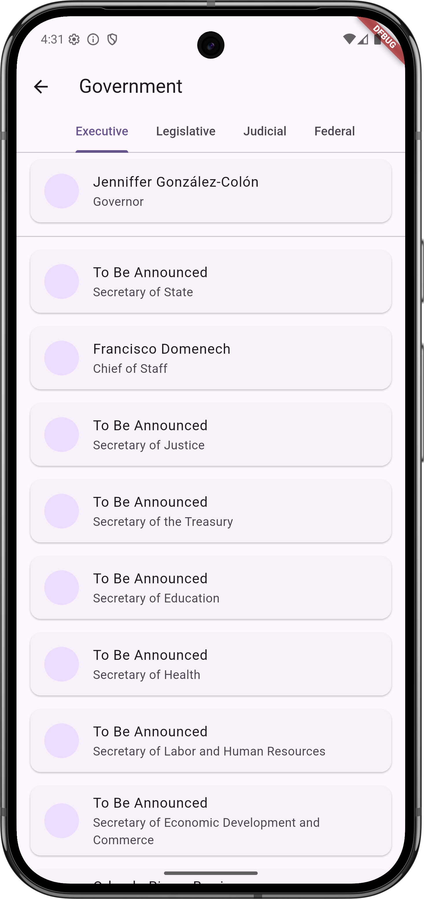
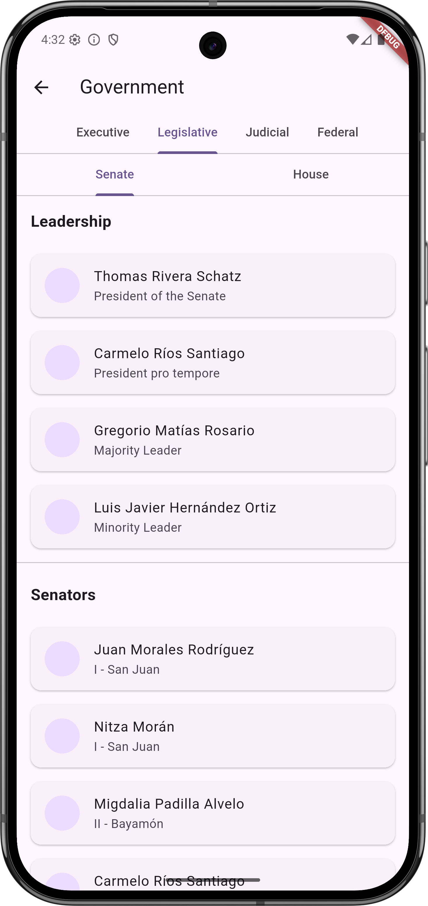
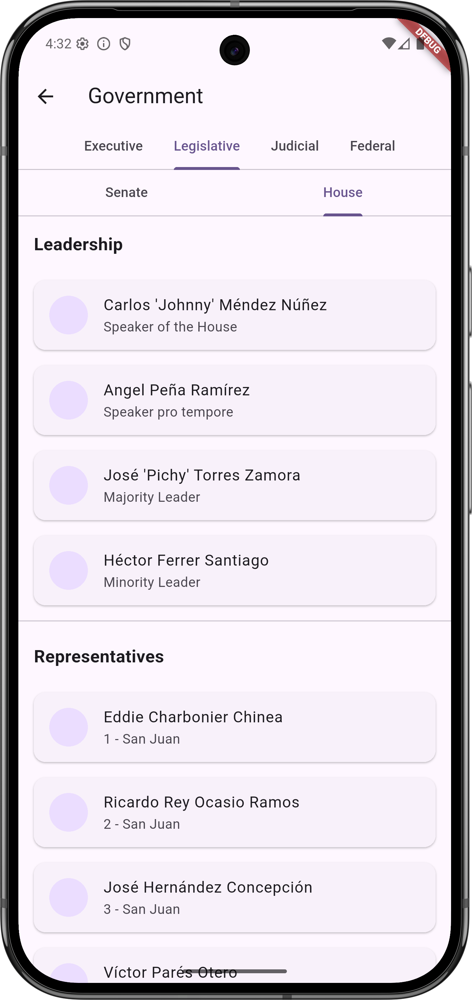
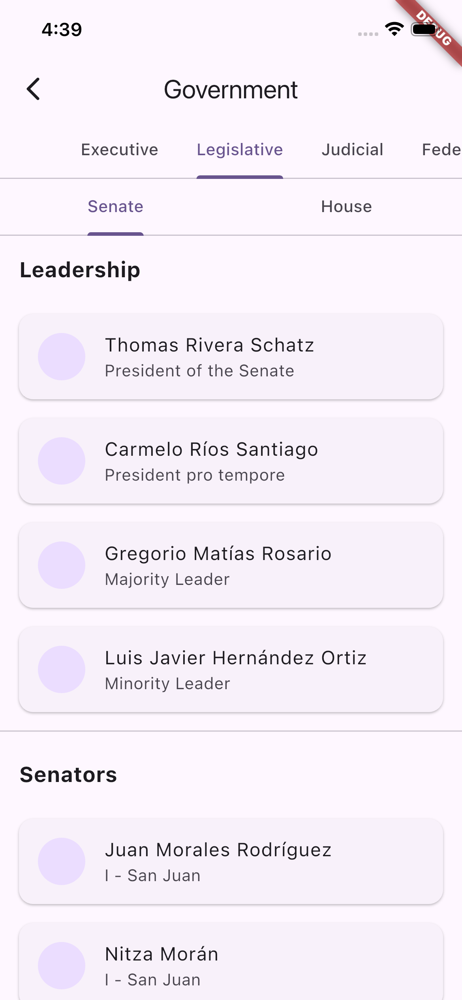
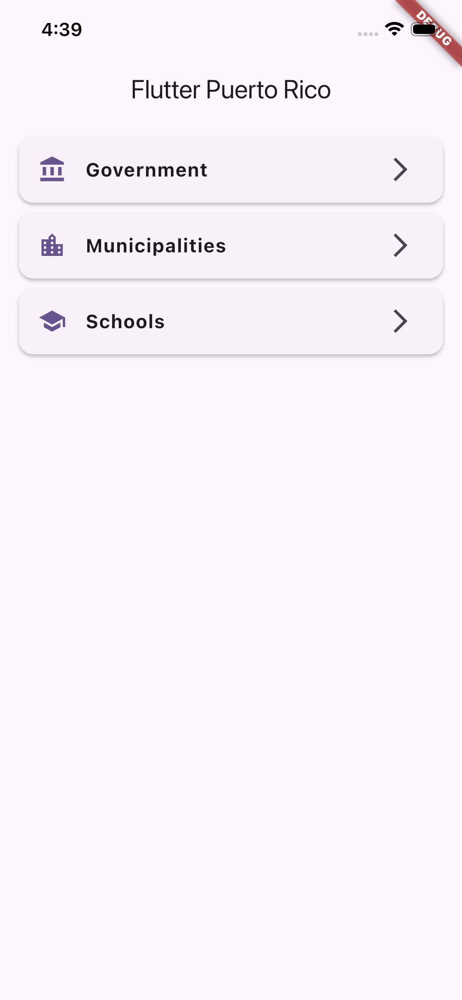

# Flutter Puerto Rico MVVM

An educational Flutter cross-platform (Android/iOS) app showcasing the usage of several open-source building block libraries and a Clean Architecture approach with the MVVM pattern. This project is intended for students and professors to learn and teach modern mobile development practices.

## Architecture

This project implements the principles of **Clean Architecture** to create a scalable, maintainable, and testable application. The core idea is to separate concerns by organizing the code into distinct layers. The dependencies between these layers flow inwards, meaning the inner layers have no knowledge of the outer layers.

The package structure reflects these layers:

*   `domain`: The core of the application. It contains the business logic, entities (models), and repository interfaces (contracts). This layer is completely independent of Flutter and any other implementation details.
*   `data`: This layer implements the repository contracts defined in the `domain` layer. It is responsible for fetching data from sources like a remote API and mapping it to the domain models.
*   `presentation`: The UI layer of the application. It's responsible for displaying data to the user and handling their interactions. This layer uses the **Model-View-ViewModel (MVVM)** pattern, where:
    *   **View:** The Flutter widgets that make up the UI.
    *   **ViewModel:** A `flutter_bloc` BLoC acts as the ViewModel. It fetches data from the `domain` layer (via use cases), manages the UI state, and responds to user events.
    *   **Model:** The UI-specific state models managed by the BLoC.

This layered architecture, combined with a well-defined package structure and dependency injection (`get_it`), promotes best practices for building robust Flutter applications.

## Testing

The project follows a comprehensive testing strategy, categorized by the architecture layers:

*   **Unit Tests**: Located in the `test` directory, these tests cover the logic that can be tested without a UI. This includes:
    *   **Domain Layer**: Testing use cases and business rules.
    *   **Data Layer**: Testing repositories and data source implementations (with mocked dependencies).
    *   **Presentation Layer**: Testing the BLoCs to verify state changes in response to events.

*   **Widget Tests**: Also in the `test` directory, these verify that the UI widgets in the `presentation` layer render correctly and respond to different states from their corresponding BLoCs.

## Dependencies

This project uses the following open-source libraries:

*   `dio`: A powerful HTTP client for Dart, which is used to make network requests to the API.
*   `flutter_bloc`: A state management library that helps to manage the state of the application in a predictable way.
*   `get_it`: A service locator for Dart and Flutter projects with a focus on performance and ease of use.
*   `go_router`: A declarative routing package for Flutter that makes it easy to handle navigation in the app.
*   `flutter_svg`: A library for rendering SVG files in Flutter.
*   `cached_network_image`: A Flutter library to show images from the internet and keep them in the cache directory.
*   `equatable`: A Dart package that helps to implement value equality without explicitly overriding `==` and `hashCode`.
*   `url_launcher`: A Flutter plugin for launching URLs.

## Screenshots

### Android

### iPhone

